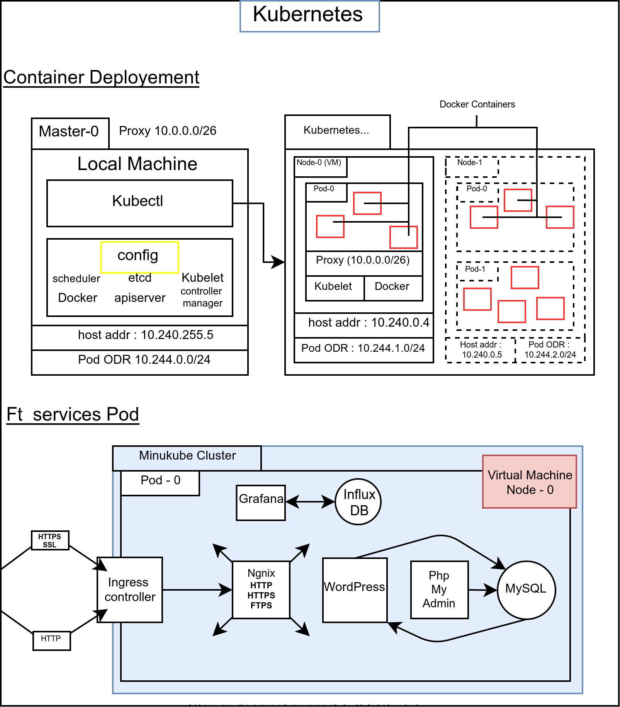

# ft_services

`ft_services` is an individual school project at [42 Paris](https://www.42.fr) campus.
The purpose of this project is to use Kubernetes to virtualize a network and set a production environment.

## Introduction

<p align="center">
  
</p>

For learning purposes only, **not intended for production**.

## Components

* Alpine Linux
* Kubernetes
* Docker
* MetalLB
* Nginx
* FTPS
* WordPress
* phpMyAdmin
* MariaDB (MySQL)
* Grafana
* InfluxDB

### Linux Alpine

We run our project on **Linux Alpine** which uses the Linux kernel.  
Alpine Linux is a security-oriented, lightweight Linux distribution based on musl libc and busybox.  
This distribution is particularly suitable, due to its lightness, for the creation of Docker container images.  
[More details here](https://wiki.alpinelinux.org/wiki/Alpine_Linux:FAQ).

### Kubernetes and Minikube

**Kubernetes** is a portable, extensible, open-source platform for managing containerized workloads and services, that facilitates both declarative configuration and automation. It has a large, rapidly growing ecosystem. Kubernetes services, support, and tools are widely available.  
[More details here](https://kubernetes.io/docs/concepts/overview/what-is-kubernetes/)  Or [Here](https://medium.com/@tsuyoshiushio/kubernetes-in-three-diagrams-6aba8432541c).  

**Kubernetes resource objects** is a high-level overview of the basic types of resources provide by the Kubernetes API and their primary functions.  
For a better understanding of Kubernetes Object Management, you'll find [More informations here](https://kubernetes.io/docs/reference/generated/kubernetes-api/v1.18/).  
This link will be helpful for create your own **YAML files**.  
Check the kubernetes objects usage of this project [here]().

**Minikube** is a tool to facilitate the local execution of Kubernetes. Minikube runs a single-node Kubernetes cluster in a virtual machine (VM) on your laptop.  
[More details here](https://kubernetes.io/docs/tutorials/hello-minikube/).

### Nginx

**Nginx** is open source software for web serving, reverse proxying, caching, load balancing, media streaming, and more. It started out as a web server designed for maximum performance and stability. In addition to its HTTP server capabilities, NGINX can also function as a proxy server for email (IMAP, POP3, and SMTP) and a reverse proxy and load balancer for HTTP, TCP, and UDP servers.

### MetalLB

**MetalLB** allows access to your Kubernetes services from outside the Kubernetes cluster. You configure access by creating a collection of rules that define which inbound connections reach which services.

if you have difficulty to understand the **interaction between Kubernetes MetalLB**, please look at this [link](https://matthewpalmer.net/kubernetes-app-developer/articles/kubernetes-ingress-guide-nginx-example.html).

### Docker

**Docker** is a tool designed to make it easier to create, deploy, and run applications by using containers. Containers allow a developer to package up an application with all of the parts it needs, such as libraries and other dependencies, and ship it all out as one package.
[More details here](https://blog.usejournal.com/what-is-docker-in-simple-english-a24e8136b90b).  
For more informations, you can also check my project `ft_server` about docker containers and docker files usage [Here](https://github.com/GuillaumeOz/42_Ft_server/).  

### Wordpress

**WordPress** (WordPress.org) is a content management system (CMS) based on PHP and MySQL that is usually used with the MySQL or MariaDB database.

### PHPMyAdmin

**PhpMyAdmin** is a free software tool written in PHP, intended to handle the administration of MySQL over the Web.
It will help to link our databases with the rest ouf our services.

### MySQL

**MySQL** is a freely available open source Relational Database Management System(RDBMS) that uses Structured Query Language (SQL).
WordPress requires MySQL to store and retrieve all of its data including post content, user profiles, and custom post types.

### FTPS

**FTPS** is a name used to encompass a number of ways in which FTP software can perform secure file transfers. Each involves the use of a security layer below the standard FTP protocol to encrypt data.

### Grafana

**Grafana** is a multi-platform open source solution for running data analytics, pulling up metrics that make sense of the massive amount of data, and monitoring apps through customizable dashboards. Available since 2014, the interactive visualization software provides charts, graphs, and alerts when the service is connected to supported data sources.

### InfluxDB

**InfluxDB** is an open-source time series database(TSDB) developed by InfluxData. It is written in Go and optimized for fast, high-availability storage and retrieval of time series data in fields such as operations monitoring, application metrics, Internet of Things sensor data, and real-time analytics. It also has support for processing data from Graphite.
In our project, InfluxDB will stock the necessairy data for running Grafana application.

### Telegraf

**Telegraf** is a metric collection agent, only one agent is required per VM. This agent knows how to collect metrics exposed in Prometheus format and offers two methods of retrieving metrics, via:

**push** : the metric is pushed into Telegraf by the component that exposes it
**pull** : Telegraf retrieves the metric by interrogating the component that exposes it (the most used mode)3

## Usage

The setup script check if : ```Docker```, ```VirtualBox```, ```minikube``` and ```kubectl``` are installed for the VM.
If not the script installs it for you.
For running the script one 42 Mac, run ```ini_docker.sh``` script.

* Setup :

```shell
# Start the setup for 42Mac
bash setup.sh 42mac

# Start the setup for VM
bash setup.sh vm

# Remove all containers
./setup.sh clean
```

## PORTS

* ```FTPS``` on port 21
* ```MySQL``` on port 3306
* ```Wordpress``` on port 5050
* ```Phpmyadmin``` on port 5000
* ```Grafana``` on port 3000
* ```InfluxDB``` on port 8086
* ```Nginx``` on port 80(HTTP), 443 (SSL) and 22 (SSH)

### Acknowledgements

School project done at [42 Paris](https://www.42.fr).
